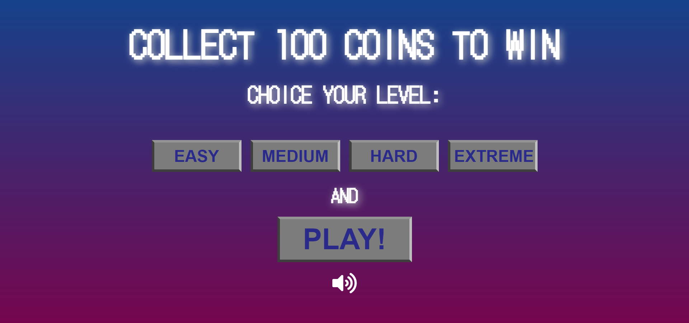
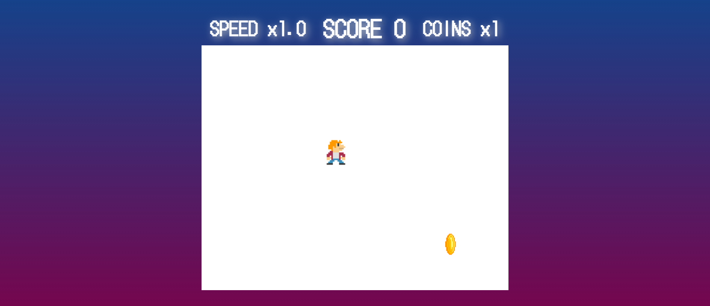
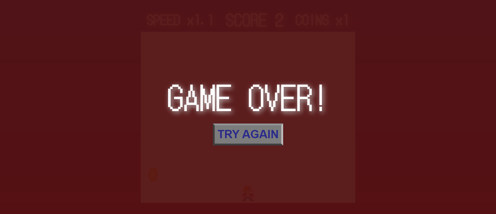

## Collect Coins - Live Demo
[Colect Coins - live preview](https://oszi91.github.io/Collect-Coins/build/index.html)

# Collect Coins - Preview




## Description:
First choose your level (extreme is possible to win, my friend checked it out!). Then choose the option with sound (I recommend - Retrowave atmosphere) or without.Control with the keyboard (a virtual version appears on your phone). Now you can play. The higher the speed, the higher the coin multiplier, and it gets more difficult.  Depending on the difficulty of level, the size of the board and the speed of the multiplier changes. Try to get 100 coins to win, good luck!

## Technologies and additional dependencies:
| Tool | Description |
| :-------------:|--------------|
| HTML5 | A markup language used for structuring, and presenting content on the World Wide Web. |
| SASS | 	A preprocessor scripting language that is interpreted or compiled into CSS. |
| Vanilla JavaScript | Pure JavaScript. |
| Webpack | Packs CommonJs/AMD modules for the browser. Allows to split your codebase into multiple bundles, which can be loaded on demand. |

## Installation:

-  ```git clone https://github.com/oszi91/Collect-Coins``` to clone the repository.
-  npm install to install all dependencies
-  npm start and http://localhost:8080/ in the browser to preview the app